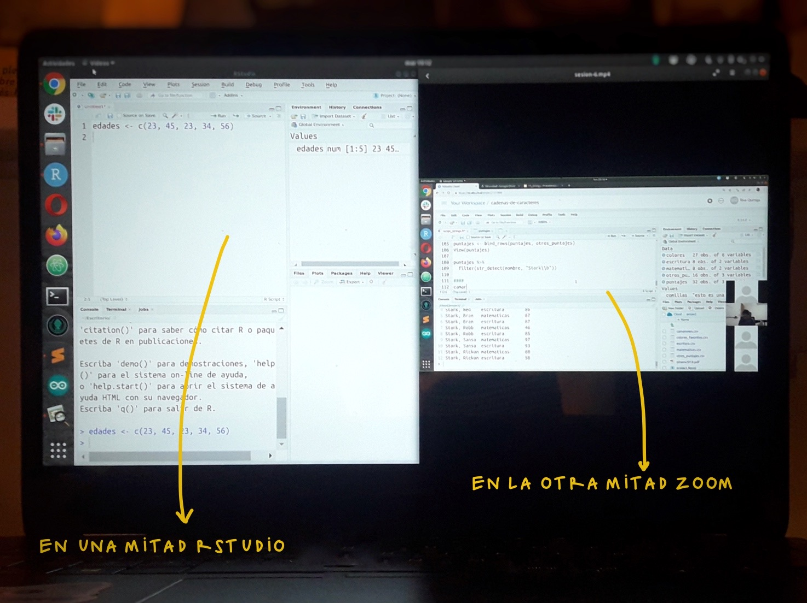
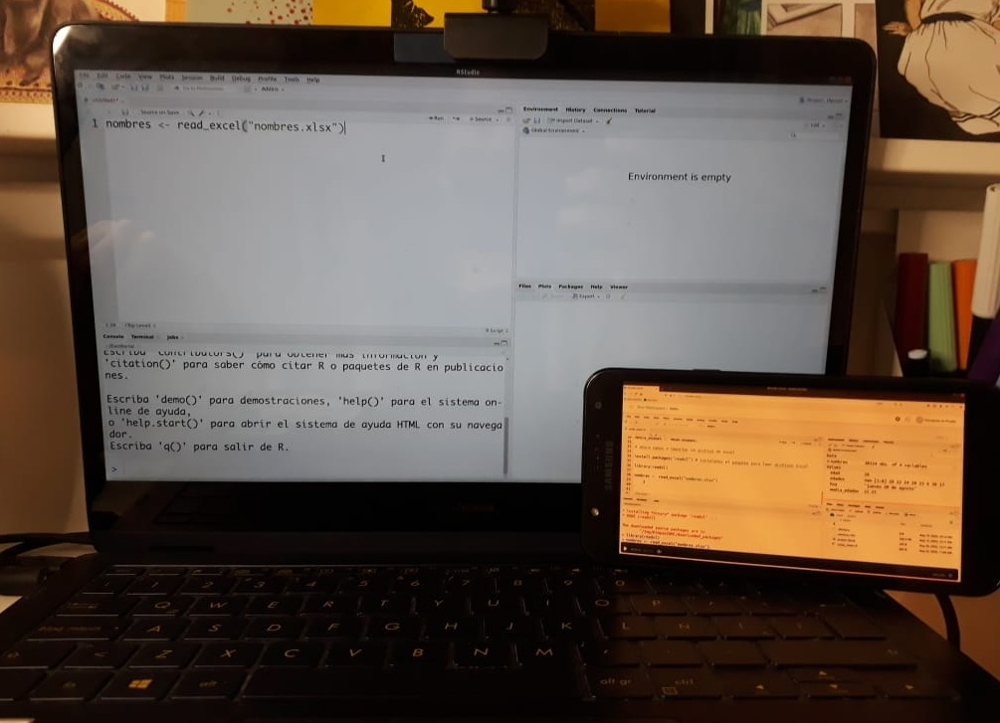

# Expresiones regulares para la limpieza y transformación de datos

**Taller a cargo de [Riva Quiroga](https://twitter.com/rivaquiroga) y [Stephanie Orellana](https://twitter.com/sporella) realizado en el marco de la edición 2020 de [LatinR](https://latin-r.com/).**

## ¿De qué se trata este taller?

Este taller tiene por objetivo que sus participantes se familiaricen con el uso de expresiones regulares (conocidas también como "regex"). Específicamente, abordaremos el potencial que tienen como parte del proceso de limpieza y transformación de datos usando paquetes del "Tidyverse". Los ejemplos prácticos se enfocarán en el trabajo con dataframes y archivos de texto y en cómo utilizar expresiones regulares en conjunto con funciones de los paquetes {stringr}, {dplyr} y {tidyr}.

## ¿Cómo me inscribo?

El taller se realizará el lunes 28 de septiembre entre 10:00 y 12:00 am UTC-3. Será ofrecido de manera conjunta por RLadies Talca, RLadies Galápagos, RLadies Ciudad de México, RLadies Valparaíso y RLadies Santiago. Puedes inscribirte a través de cualquiera de estos enlaces:
- [RLadies Talca](https://www.meetup.com/es/rladies-talca/events/273486730/)
- [RLadies Galápagos](https://www.meetup.com/es/rladies-galapagos-islands/events/273493704/)
- [RLadies CDMX](https://www.meetup.com/es/rladies-cdmx/events/273511609/)
- [RLadies Valparaíso](https://www.meetup.com/es/rladies-valparaiso/events/273511476/)
- [RLadies Santiago](https://www.meetup.com/es/rladies-scl/events/273511502/)

## ¿Qué necesito para participar?

Para este taller es necesario tener una versión de R igual o superior a 3.6 y tener instalados RStudio y los paquetes {tidyverse}, {janitor}, {pdftools} y la versión en desarrollo de {datos}. Esta última se puede instalar desde GitHub con: `remotes::install_github("cienciadedatos/datos")`. Puede que tengas que instalar antes el paquete {remotes}.
El taller se dictará a través de la plataforma Zoom. 
Esta es una actividad que se desarrolla en el marco de LatinR, por lo que participar supone haber aceptado el [Código de Conducta](https://latin-r.com/cdc/) de esta conferencia. 

## Prepara tu espacio de trabajo

Este es un taller práctico. Durante las dos horas que dura escribiremos código en vivo, es decir, iremos escribiendo el script en el momento. Lo ideal es que vayas replicando en tu computador todo lo que hagamos. Para ello, es necesario que pienses en alguna configuración de pantalla que te permita ir mirando lo que hacemos en Zoom y replicándolo en RStudio.  

A continuación hay algunas opciones:

### Una mitad de la pantalla para cada cosa

Es la opción más simple y no requieres nada más que tu computador. 

### Una segunda pantalla

Esta es la opción más cómoda, pero no siempre es posible porque requieres más cosas que solo tu computador. Aquí van algunas ideas, en caso de que no tengas un segundo monitor.

#### Conectar tu computador a un televisor

Luego de conectarlo, configura tu computador para que las pantallas no se dupliquen, sino que veas dos cosas distintas en cada una. Así podrás trabajar en tu computador e ir mirando el taller en el televisor:

#### Usar otro dispositivo

Si tienes una tablet, puedes conectarte a Zoom desde ella para participar en el taller y en paralelo trabajar en tu computador. Puedes intentarlo también usando tu teléfono móvil, pero es posible que se vea demasiado pequeño el código. En todo caso, como explicaremos al inicio del taller, todo el código que vayamos escribiendo nosotras se actualizará en línea en un link que indicaremos al inicio de la sesión, por lo que si no ves bien algo en tu teléfono, puedes revisarlo ahí. Puede que esto suene un poco misterioso ahora, pero al inicio del taller lo explicaremos. 

### Ninguna de las anteriores

El taller quedará grabado. Si prefieres, durante el taller puedes solo mirar y luego, cuando el video esté disponible, replicar con calma todo lo que hicimos. 

## Materiales utilizados durante el taller

[Código](https://www.dropbox.com/s/4oa01qq6xtguurw/script-taller-regex.R?dl=0)

## Video del taller

El video del taller se publicará en el [canal de YouTube](https://www.youtube.com/channel/UCt950nC6jlh2ELDRPigWOkg) de LatinR una vez que termine la conferencia. 

## Material complementario

Si quieres profundizar sobre el tema del taller, puedes revisar [el capítulo 14 del libro "R para Ciencia de Datos"](https://es.r4ds.hadley.nz/cadenas-de-caracteres.html), que aborda el trabajo con cadenas de caracteres. También puede ser útil tener a mano la [_Hoja de referencia_](https://github.com/rstudio/cheatsheets/blob/master/translations/spanish/strings_Spanish.pdf) del paquete {stringr}.

